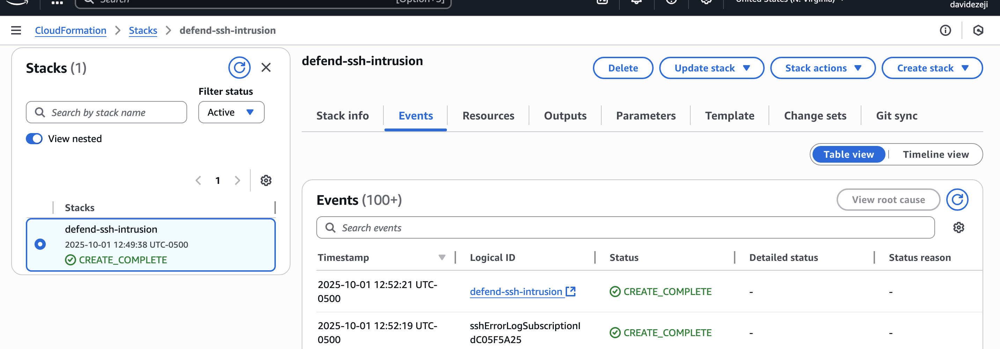
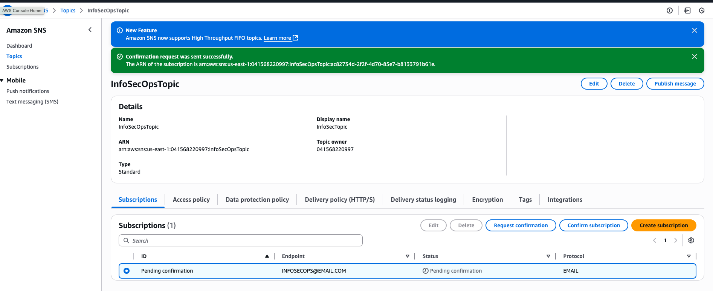
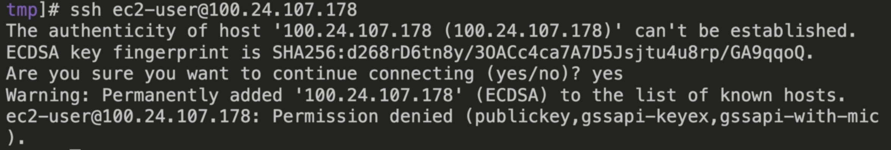
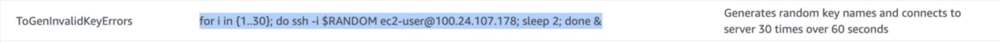
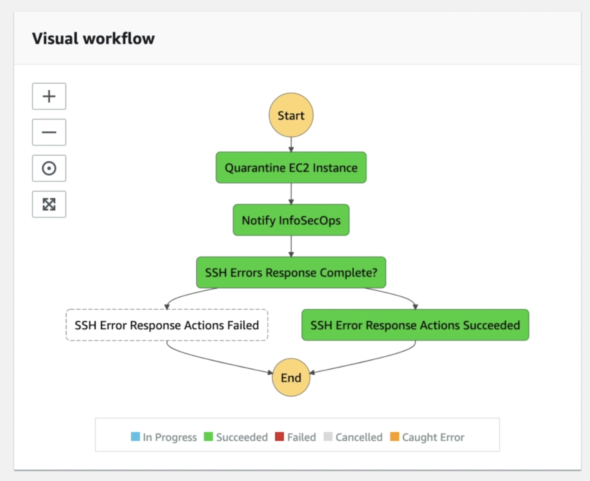
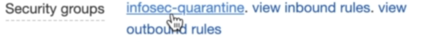
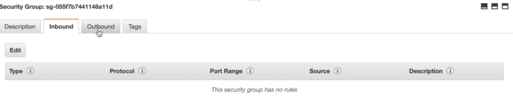
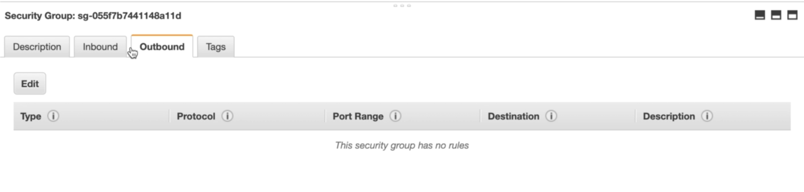

# Proactively Monitor and Respond to Failed SSH Logins to EC2 Instances Using CloudWatch

**Scenario:** Let's say you want to defend your ec2 instances running critical applications, from intrusion attempts. Within your organization you give developers SSH access to these instances, but you need a proactive method of preventing bad actors from having similar access.

**Security Steps:**
1. Maliscious user tries to ssh into instance 
2. Cloudwatch agent installed on ec2 instance monitors logs of ssh attempts and sends them to cloudwatch logs 
3. In cloudwatch logs custom metrics alert a Lambda function (e.g. using the "ssh_invalid_user" log filter) 
4. A Lambda function will be subscribed to this log group invokes step functions 
5. Step functions check instance to see if there are an abnormal amount of ssh attempts, furthermore isolating the instance and sending a notification to the security team of what is going on.

**Note:** This security setup can be deployed in your aws account using the CloudFromation template called "remediate-ssh-access.template.json" in this repository.

## Steps
1. Deploy CloudFormation stack 

2. Make sure to subscribe to the SNS topic in your email

3. Try to trigger a failure - currently there is no associated key pair to the instance created by the CloudFormation Stack. Therefore any attempt to SSH into the instance from your local machine will result in a failure

4. These actions should have triggered the step functions based on cloudwatch logs and triggered the defined remeediation steps

5. As part of the remediation you should now see a new security group attached to the instance called infused-quarantine, this has no inbound/outbound rules effectively isolating the instance

