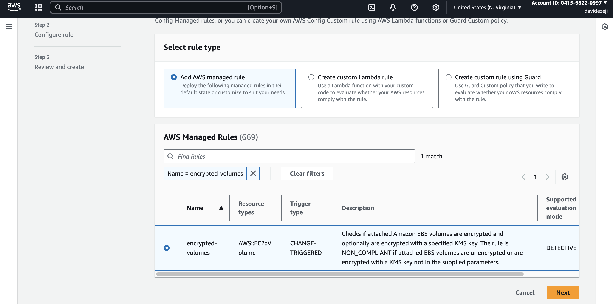
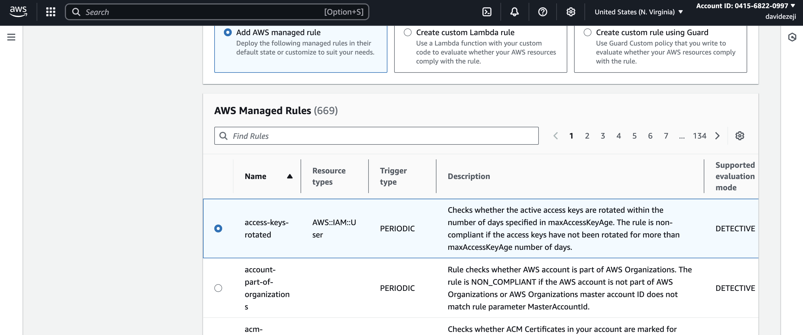
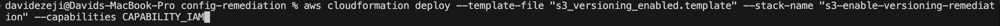
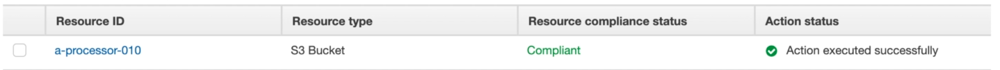

## AWS Detective Control using AWS Config
**Overview:** Created two ec2 instances, one with public ports opened (e.g. port 22), and one with 5 ebs volumes attached (some encrypted vs. others that were non-encrypted). I then created config rules to monitor these resources and others created in the future.

**Config rules:**
- ec2 ports that are open to the public (mark them as “NONCOMPLIANT” )

- EBS volumes are encrypted for all instances across AWS account

- EBS volumes are correctly attached to instances

- Check to see if access keys are older as 90 days (make them as “NONCOMPLIANT”)

- IAM groups have at least one IAM user

- I also created an AWS config aggregator to ensure that I can use these same config rules to also monitor resources in another aws account 

Outcome:
- After creating my resources and config rules, 6 resources were marked as noncompliant in my main account.

- In the aggregated dashboard I see a few more noncompliant resources

**AWS Config Remediation**

I also created some additional config rules via cloudformation to:
- enable s3 bucket versioning
- enable s3 bucket server side encryption
- ensure no public IPs for ec2 instances (stops them, doesn't delete them)
- ensure ec2 instances are using a specific AMI identified by tag/ID

** In order to enforce compliance for these rules I added onto the cloudformation scripts auto-remediation steps for noncompliant resources (scripts can be found in the "cloudformation" folder)

Example: Here is my deployment of the cloudformation script to ensure s3 bucket versioning is enabled across my AWS account.

* Deployment of cloudformation...

* S3 buckets that are not versioned are marked as noncompliant...

* S3 bucket which is noncompliant (non-versioned) is identified and remediation moves it from noncompliant to compliant

* **Summary:** When AWS Config finds a bucket without versioning enabled, it triggers the remediation config, which calls the SSM Automation Document "AWS-ConfigureS3BucketVersioning". That document runs under the AutoRemediationIamRole, which has permissions to update the bucket’s versioning settings. This is how the bucket is automatically remediated.

## Summary
Here are some of the most important config rules (provided directly from AWS) to secure your account(s):
- iam-group-has-users-check
- iam-password-policy
- s3-bucket-versioning-enabled
- encrypted-volumes
- s3-bucket-server-side-encryption-enabled
- ec2-volume-inuse-check
- restricted-ssh
- access-keys-rotated
- approved-amis-by-tag

