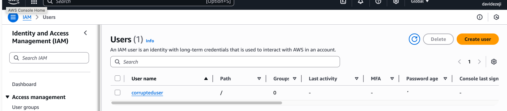
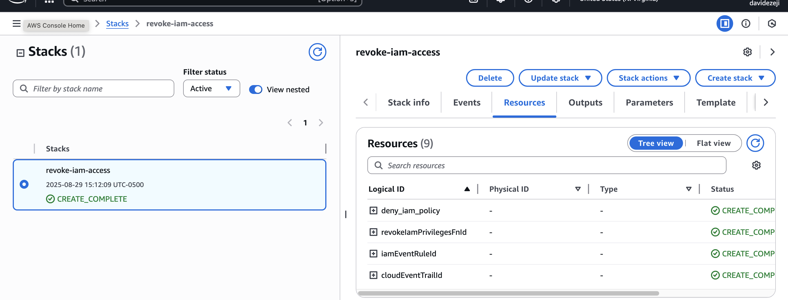
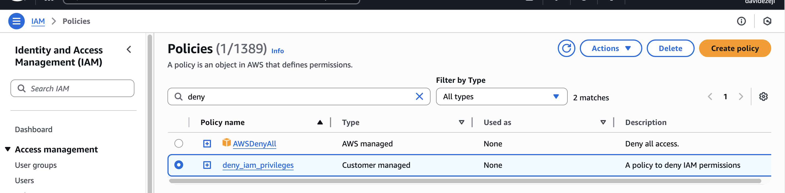
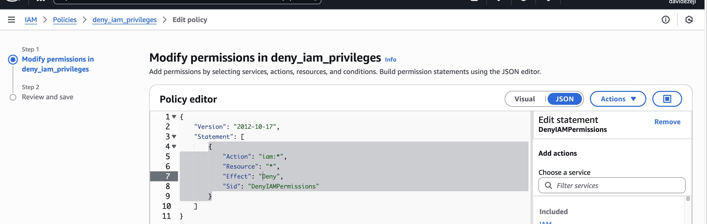
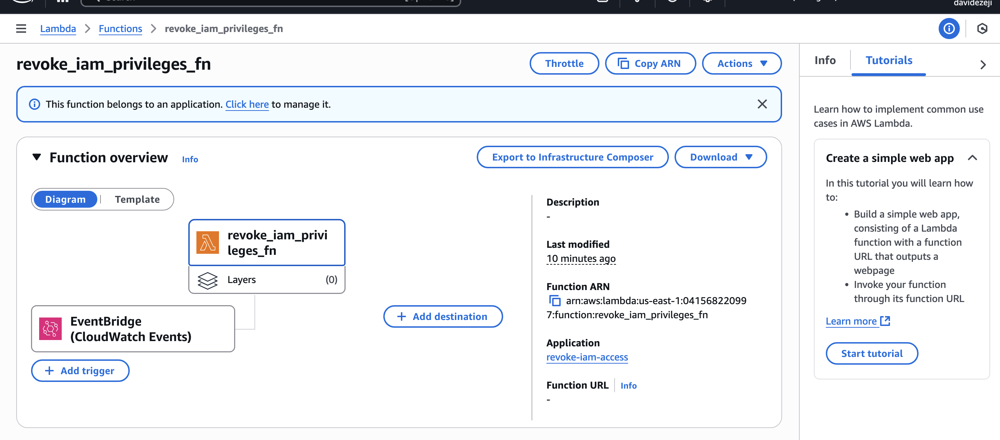
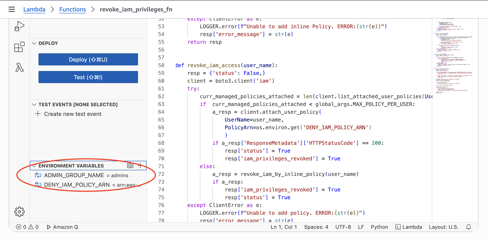
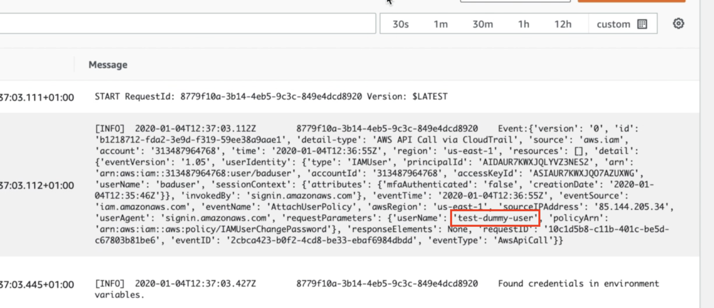
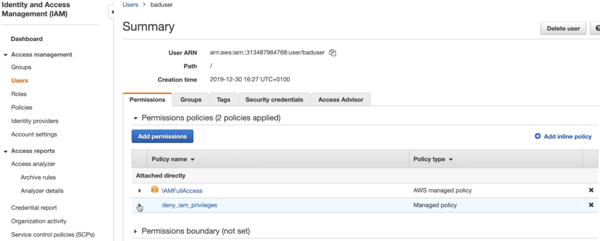
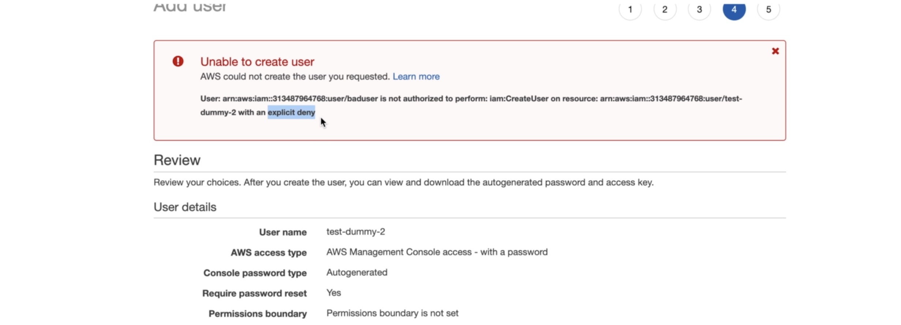

# Security Automation to Remediate Unintended IAM Access

**Scenario:** Let's say an organization has multiple AWS accounts that are shared across multiple departments. As the number of employees grows, they find it difficult to monitor the permissions of users. For instance, the organization would like to control who can:
- create new users in AWS account(s)
- make modifications to existing users/groups

They would ultimately like to be able to revoke priviliges in case of such security incidents.

**Goal:** Use IAM, Lambda, Cloudwatch, Step Functions and SNS to proactively monitor and automatically revoke unintended IAM access.

**Overview:** 

Here is an overview of the cloudformation template (revoke-iam-access.template.json) used for this security project:

1. Create a "DENY-IAM" policy: An IAM policy which denies IAM permissions and takes precedence over all other IAM policies.
2. Create Lambda function: This checks which group a user is a part of, if the user is part of the "admins" groups, no action will take place. However, if they are a part of another group the user will be given the "DENY-IAM" policy.
3. Create an EventBridge rule: This is the source trigger for the lambda function. Eventrbridge will only be triggered if invoked by an IAM API event.
4. Create a CloudTrail trail: This will monitor all IAM API events, seeing who initiated IAM actions.
5. Create IAM roles: These roles are given to lambda and step functions to perform appropriate actions.

**Steps:**

1. Create an IAM user to test the solution. Give this user full IAM privileges and ensure that they are not part of the admins group.

    

2. Deploy the CloudFormation stack 

    

3. A policy should now be created to deny IAM privileges to necessary users

    
    

4. In the lambda function ensure the value for the environment variable ADMIN_GROUP_NAME is set to “admins”

    
    

5. Log into another browser using the created user’s credentials and attempt to create a new IAM user or policy in the same AWS account.

6. Cloudwatch events reports that a new user (“test-dummy-user”) was created, kicking off the remediation process

7. Now the IAM user which created the test-dummy-user has a deny iam policy attached to them, not allowing them to create further IAM resources

8. The user is now unable to create a second IAM user due to the attached policy
