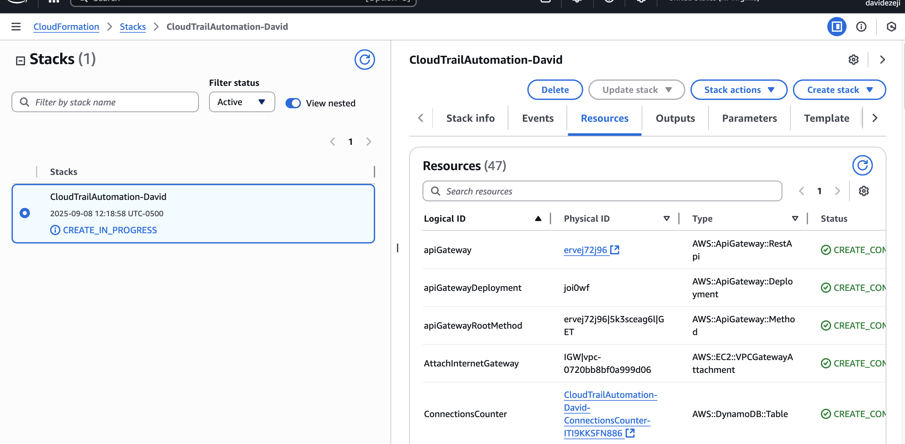
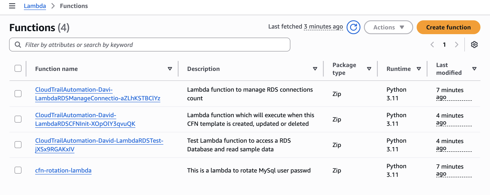
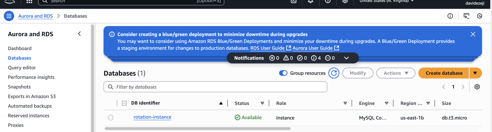
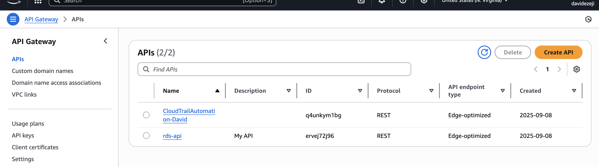
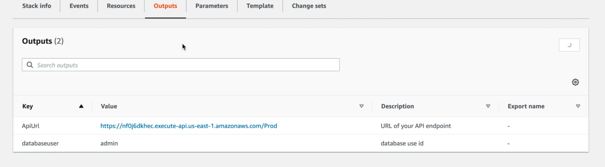
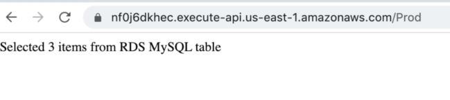
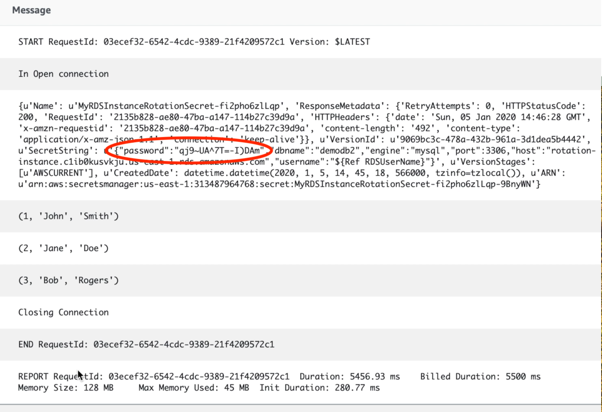
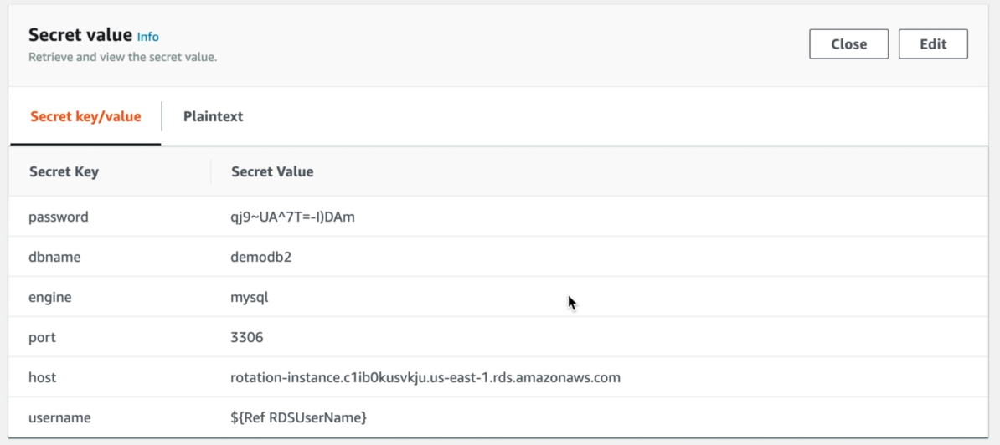

# Secrets Manager

**Scenario:** This project shows how you can store database credentials in AWS Secrets Manager and avoid hardcoding them in applications. We will simulate how an application can make a request to an RDS database using API gateway and ensure that our credentials are continuously rotated (every 30 days) via Lambda.

### Workflow
```
1. User makes request ---> 2. Request goes through API gateway (url output from CloudFormation) ---> 3. Trigger lambda to fetch secrets from secrets manager (on the backend secrets manager pulls them from RDS) ---> 4. credentials are given back to the user ---> 5. Lambda rotates secrets every 30 days
```

**Secrets Manager Cloudformation Script Breakdown:**

This CloudFormation template provisions a private RDS database with managed secrets, rotation, and Lambda/API access inside a properly secured VPC.

* Creates a VPC with public and private subnets, plus routing, NAT, and internet access.
* Deploys a MySQL RDS instance in private subnets (not publicly accessible).
* Stores the database credentials in AWS Secrets Manager and enables automatic password rotation using a rotation Lambda.
* Sets up Lambda functions to manage connections, test database access, and handle stack initialization.
* Exposes a simple API Gateway endpoint that invokes a test Lambda to query the database.
* Uses DynamoDB to keep track of RDS connections.
* Configures IAM roles and security groups to enforce least-privilege access and secure communication between components.

## Steps
*Note: The cloudfomation script is incorrectly named "CloudTrailAutomation-David" in some of the screenshots below, but the main functionalities remain*

1. Deploy the CloudFormation script which creates all the necessary infrastructure/connections





2. Try making a request to retrieve credenetials via the API gateway url (found in output of CloudFormation stack)



3. Lambda logs show details of the request and the secrets that were shared via secrets manager


4. Check secrets manager to ensure the same value was pulled via Lambda


5. Now the user does not have to worry about remembering their password as it's given to them and this value gets automatically rotated every 30 days!
