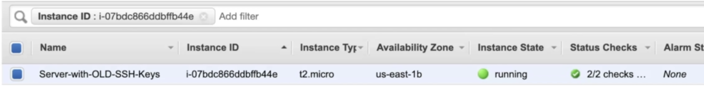
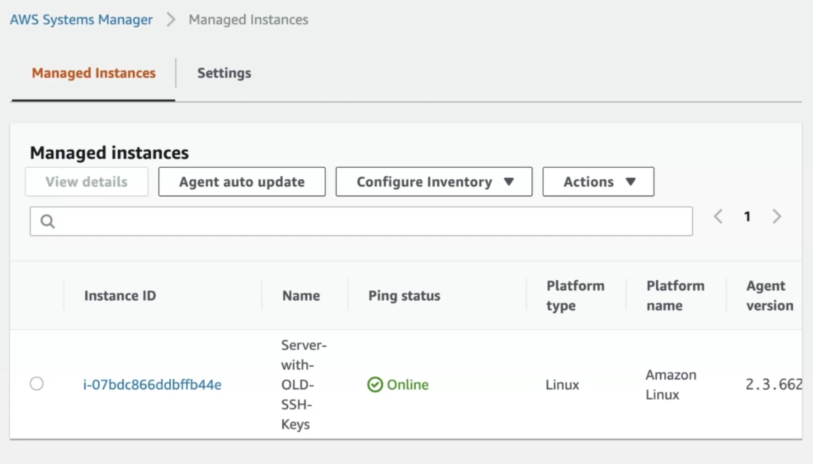
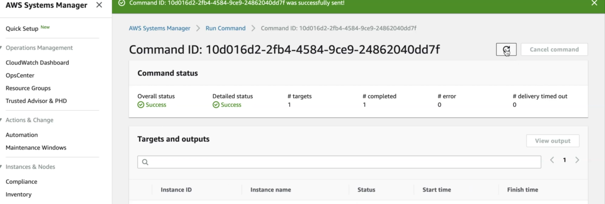

# How to Automatically Rotate EC2 SSH Keys Reliably with AWS Systems Manager (SSM)

Scenario: One of the best practices in security is to rotate access keys frequently. In this project we will see how to automate this process for several instances in an AWS account on a routine schedule.

**Pre-requisites:** 
* For every instance deployed, you should have ssm-agent installed.
* IAM role that enables SSM to run commands in your ec2 instance.

## Steps
1. Spin up instance(s)


2. Since SSM agent is installed you should see it as a managed instance in systems manager


3. On your local terminal create a public key
4. In the AWS Systems Manager console go to Instances & Nodes and hit “Run Command”
5. In the drop down select AWS-RunShellScript
6. Scroll down to Command parameters and create a shell script as such:

```
#!/bin/bash

/bin/echo -e “PUBLIC_KEY” >> /home/ec2-user/.sshauthorized_keys
```
11. Scroll down to Targets and select “Choose instances manually” and select your instance
12. Click on Run

13. Now if you periodically check /home/ec2-user/.ssh/authorized_keys, you will see new keys being added for authorization over time