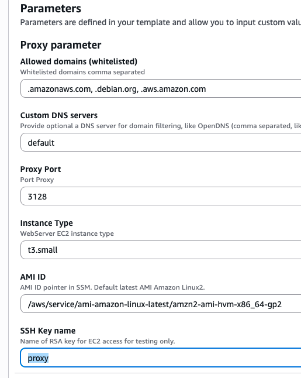
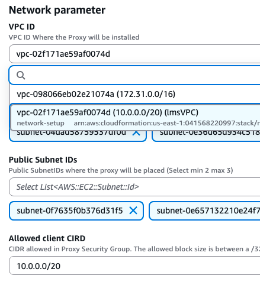
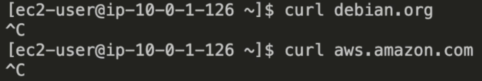

# How To Use an Outbound VPC Proxy for Domain Whitelisting and Content Filtering

**Scenario:** You want to secure your outbound traffic from your VPC in AWS. You desire to filter the content that the servers in this VPC can access both at the URL and IP address level. By restricting servers from potentially reaching out to bad actors, you protect the security of your internal network.

## Network Architecture
*** Note: A bastion host is used provisioned to connect to the application instance and check if  

## Steps
1. Create a key pair

2. Deploy the cloudformation stacks
- First deploy the networking stack (network_setup.json) (this creates a VPC, bastion host and private instance)

3. After the network stack has been successfully deployed, create the network proxy stack (proxy_setup.yaml)
- Make sure to add your key name under “SSH Key name” in the parameters section

- Make sure to select the newly provisioned VPC/subnets in the parameters section (filter searches for subnets with “private-subnet” and “web-subnet” to select the two subnets for public/private)

- Note the whitelisted domains used for egress traffic in the “Allowed domains” parameter section

- In the “Allowed Client CIDR” section give the mask defined in the VPC ID value

4. Test out the solution
- Ssh into the bastion host 

- Connect to the private instance via the bastion host 

- Test the limitations of outbound permissions of the private instance without the proxy server being connected to it (you should note that the instance is not able to reach the whitelisted domains) 

- Connect the proxy instance to the private instance (remember to use sudo when running the command)

- Now try to access a whitelisted domain it should now be able to reach it

- Now try a non-whitelisted domain and you should notice the private instance cannot connect to it (before setting up the proxy we did not get an “access denied” message, the request just hung up, but now we can clearly see the proxy is blocking the outbound routing from happening)

