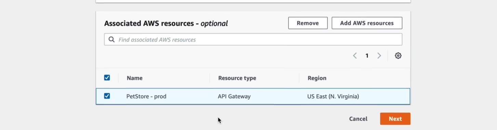

# DDoS Prevention using AWS Web Application Firewall (WAF)

**Scenario:** Let's say a maliscious user is flooding your API gateway with requests, overwhelming and disrupting your ability to serve real customers and perform normal operations.

**Goal:** In this project, we will use a Web Application Firewall to limit the chance for DDoS attacks. With this firewall, we will institute a rate limit rule which analyzes the metadata of requests that are occuring at a high frequency, and effectively blocking the user for a period to stop them from overwhelming the API.

## Steps

1. Create an API gateway

2. Test it on a browser to ensure that it is working correctly

3. Configure a Web Application Firewall to sit in front of your API gateway (create Web ACL)

4. make sure to choose the API you created under the Associated AWS resources section during WAF setup

5. During WAF setup create a rate based rule that sets a rate limit of 200. This means that if someone makes 200 requests to the API within a five minute period, that IP address will get blocked for some time.

6. Spin up an Amazon linux ec2 instance to help simulate a DDoS attack

7. Install apache workbench on the instance an simulate an attack on the API gateway using the provided script (commands can also be found in attack_script.sh)

8. Execute attack command a couple of times (line 16 of script) and eventually the firewall should eventually block the attempts after 5 minutes

9. Within five minutes access should be forbidden to your instance

